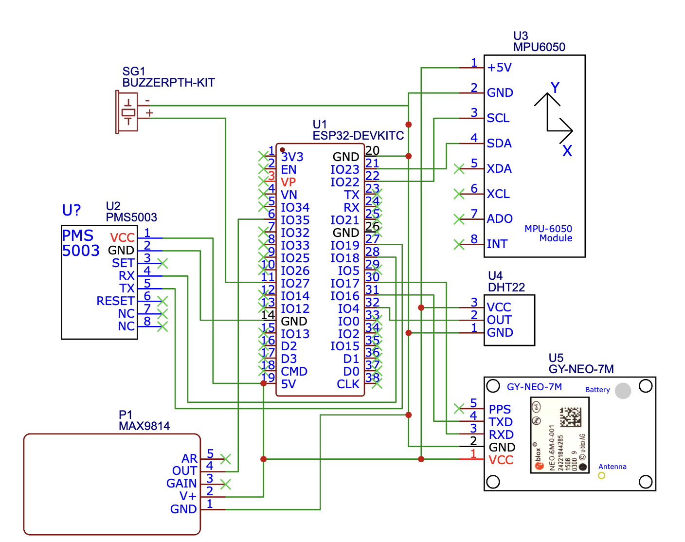
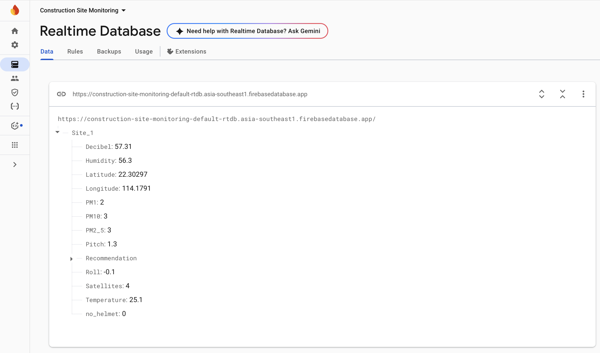
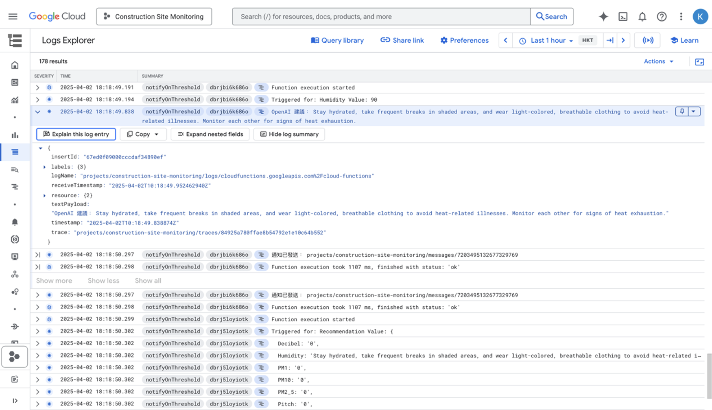
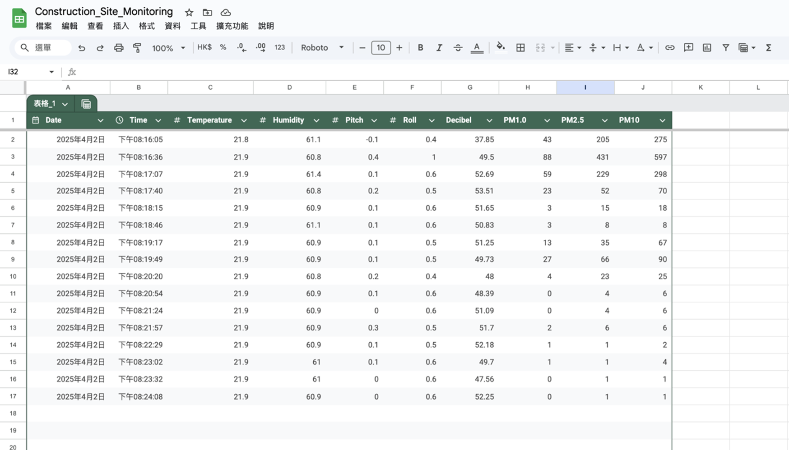
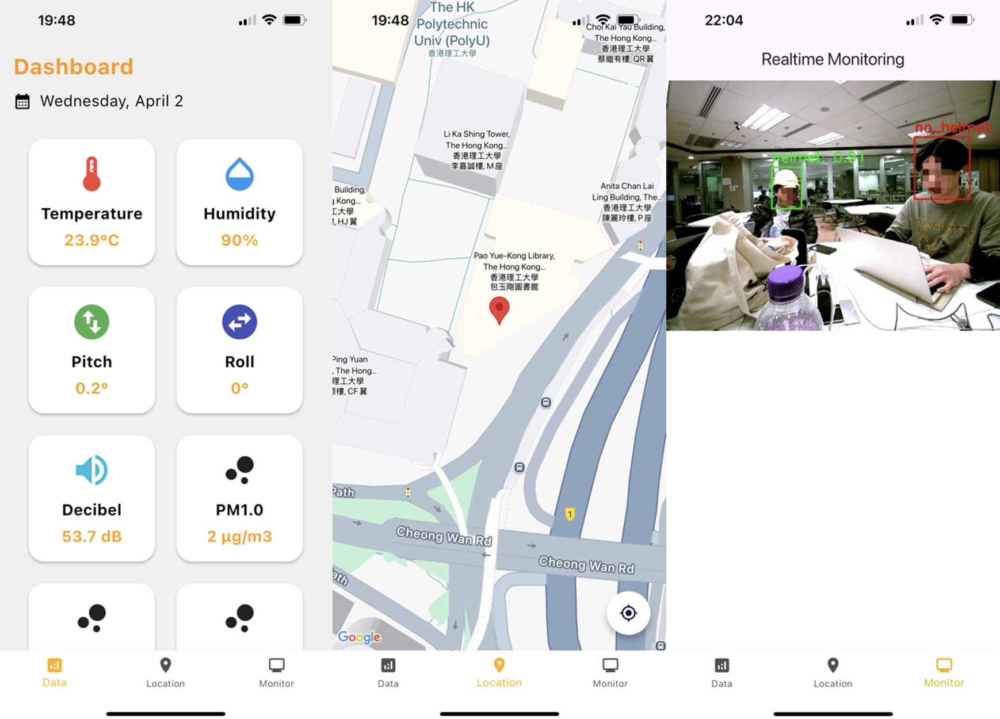

# Smart Construction Site Monitoring System

## System Architecture
The system includes multiple interconnected subsystems to monitor the construction site's environmental conditions and ensure workers follow the safety protocol. Figure 1 shows the structure of the smart construction site assistant. It consists of environmental monitoring with ESP32 and several sensors and AI-based safety monitoring with Jetson Orin Nano.

The environmental monitoring includes DHT22, MPU6050, GPS module, PMS5004, MAX9814, and buzzer connected to the ESP32 microcontroller. It will collect and upload these data to Firebase for real-time monitoring and Google Sheets for historical logging. 

The AI-based safety monitoring includes a USB camera connected to Jetson Orin Nano, which implements helmet detection using the AI model. The Jetson Orin Nano will host a Flask server to stream the camera feed. At the same time, the local host server will be exposed to the public internet through the Cloudflare Tunnel for real-time monitoring. 

The mobile application will display the sensor data, such as temperature, humidity, pitch, roll, decibel, location, PM1.0, PM2.5, PM10, and real-time camera feed. When environmental thresholds are exceeded, or a worker doesn't wear a helmet, the system uses Firebase Cloud Functions to invoke the ChatGPT API, which generates relevant safety recommendations and alarms to assist site managers in decision-making.

Figure 1

## Sensor Integration
Figure 2 shows the schematic design of the environmental monitoring system. There are wiring connections between the ESP32 microcontroller and various environmental sensors. Its wiring connections are based on UART, I2C, analog input, and digital I/O to identify the GPIO pins allocation. This configuration can allow the system to collect real-time environmental data and trigger alerts based on preset safety thresholds. Table 1 shows the various sensor and ESP32 microcontroller GPIO connections.

Figure 2

## Firebase Realtime Database
Figure 3 presents the detected data, including decibel, humidity, latitude, longitude, PM1.0, PM2.5, PM10, pitch, roll temperature, recommendation, and "no_helmet." The "no_helmet" status will update based on the recognition results. It will show how many people are not wearing the helmet. In the testing, satellites can display the signal strength and accuracy of the current GPS location.

Figure 3

## Cloud Function
The function is triggered by database environmental data. When an exceeded threshold is detected, the function will retrieve the updated values and send a prompt to the ChatGPT API through HTTPS. The prompt instructs the ChatGPT to generate practical safety recommendations for construction workers. Figure 4 demonstrates the Cloud Function's real-time execution. The function was triggered when the humidity value exceeded the preset threshold. It will send a request to the OpenAI ChatGPT API to generate the advice.

Figure 4

## Google Sheets
The system implements historical data logging using Google Sheets. The Google Sheets will store detected data as historical records for further analysis and reference. It addresses the real-time database that does not retain historical data limitations. Each new environmental data entry is appended as a new row to ensure chronological sequence for accurate tracking of events.

The Google Script ID has been used in the Arduino IDE to establish a connection between the ESP32 and the Google Apps Script. It allows the ESP32 microcontroller to send environmental data into Google Sheets in real time. Figure 5 presents environmental data collected by sensors and storage records. There are date, time, temperature, humidity, pitch, roll, decibel, PM1.0, PM2.5, and PM10.

Figure 5

## Mobile Application
The mobile application is designed to provide real-time environmental condition monitoring, location tracking, and surveillance. It provides intuitive data visualization to make it convenient for users to access critical safety information. The application is the primary user interface for construction site managers to monitor environmental conditions and worker safety remotely. The application obtains environmental data from the Firebase Real-Time Database. The mobile application consists of data, location, and monitor pages. Figure 6 demonstrates these pages.

Figure 6

