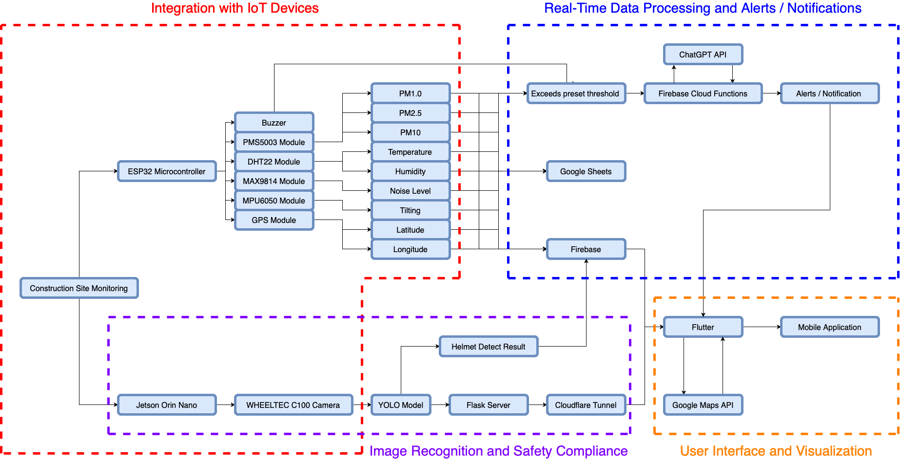

# Smart Construction Site Monitoring System

## System Architecture
The system includes multiple interconnected subsystems to monitor the construction site's environmental conditions and ensure workers follow the safety protocol. Figure 1 shows the structure of the smart construction site assistant. It consists of environmental monitoring with ESP32 and several sensors and AI-based safety monitoring with Jetson Orin Nano.

The environmental monitoring includes DHT22, MPU6050, GPS module, PMS5004, MAX9814, and buzzer connected to the ESP32 microcontroller. It will collect and upload these data to Firebase for real-time monitoring and Google Sheets for historical logging. 

The AI-based safety monitoring includes a USB camera connected to Jetson Orin Nano, which implements helmet detection using the AI model. The Jetson Orin Nano will host a Flask server to stream the camera feed. At the same time, the local host server will be exposed to the public internet through the Cloudflare Tunnel for real-time monitoring. 

The mobile application will display the sensor data, such as temperature, humidity, pitch, roll, decibel, location, PM1.0, PM2.5, PM10, and real-time camera feed. When environmental thresholds are exceeded, or a worker doesn't wear a helmet, the system uses Firebase Cloud Functions to invoke the ChatGPT API, which generates relevant safety recommendations and alarms to assist site managers in decision-making.

Figure 1

